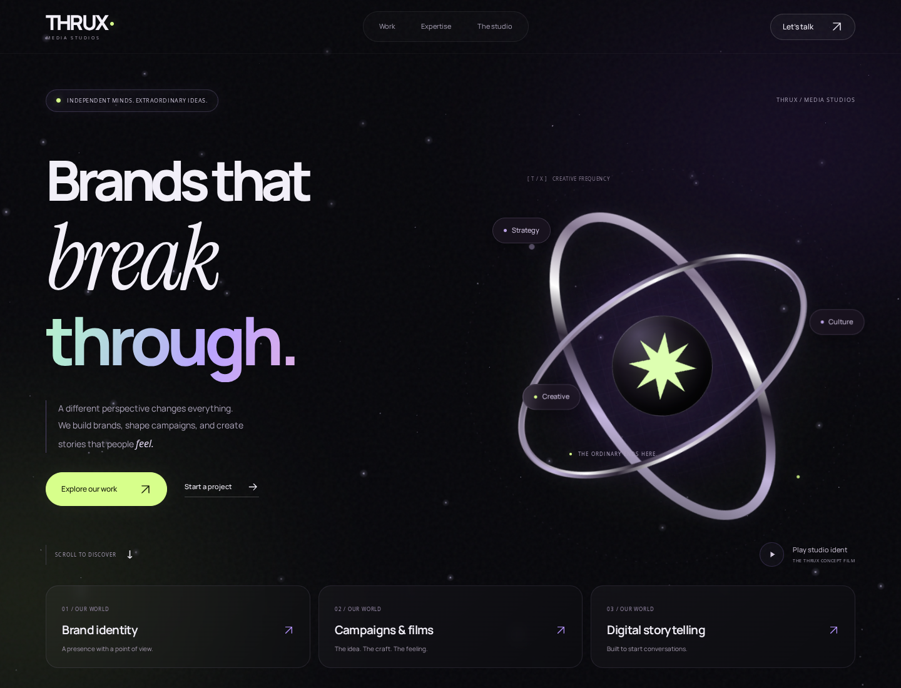

# THRUX — Brands that break through.

A complete Next.js, React and TypeScript website for THRUX Media Studios, prepared for Vercel. Version 2 replaces the original restrained layout with an atmospheric, interactive design inspired by the supplied portfolio reference.



[Motion preview](docs/previews/motion.mp4) · [Mobile preview](docs/previews/mobile.png) · [Work preview](docs/previews/work.png)

## Run it

Use Node.js 22 or 24. From the extracted `thrux` directory:

```bash
npm ci
cp .env.example .env.local
npm run dev
```

Open `http://localhost:3000`. No credentials are required to see the design and animations.

For the production build:

```bash
npm run test
npm run typecheck
npm run build
npm start
```

The lockfile is included. Builds reuse the bundled local posters; they do not need to download client media from Drive. To explicitly refresh source posters, run `npm run media:sync`.

## What changed in v2

- A live starfield with drifting particles, twinkling lights, pointer parallax and occasional shooting-star trails.
- A rotating chrome orbital graphic, floating discipline labels and a glowing central studio mark.
- Locally served Manrope and Instrument Serif typography, with an animated multicolour headline treatment.
- A glass navigation bar, illuminated pill controls, button light sweeps and a scroll-progress indicator.
- Portfolio cards with pointer-tracked spotlights, subtle perspective tilt, image zoom, collection badges and animated link controls.
- Stronger scroll reveals and a moving discipline strip.
- One consistent dark visual system across Home, Work, collections, Expertise, Studio, Contact and Privacy.
- Real source posters now bundled for commercial work, hospitality and behind the scenes.

Motion respects the system's reduced-motion preference, including changes while the page is open. Touch devices retain the atmospheric design without cursor tracking or card tilt. The starfield pauses in background tabs. Page scrolling remains native, and the normal pointer remains available.

## Pages and functionality

| Route | Content |
| --- | --- |
| `/` | Animated introduction, selected work, studio approach, services and process. |
| `/work` | Four curated collections, discipline filters, search and empty-state reset. |
| `/work/[slug]` | Reusable collection layout with media, story, gallery and next-collection navigation. |
| `/expertise` | Service accordions and the creative process. |
| `/studio` | Studio approach, values, real BTS imagery and concept-film dialog. |
| `/contact` | Validated enquiry form, service selection, optional budget/timeline and email integration. |
| `/privacy` | Editable privacy implementation notice. |

The four collection slugs are `fashion-in-motion`, `commercial-stories`, `a-taste-of-place` and `inside-the-frame`. They describe the supplied archive; they do not invent client briefs, campaign results or production credits.

## Source media

Eight posters/reference images from the supplied Drive archive are included in `public/media/`. Three fashion assets could not be retrieved and still show clearly labelled designed fallbacks. One BTS poster is almost black, so it is retained for reference and excluded from the visible studio/gallery selection. The header wordmark remains a proposed text treatment.

To supply prepared fashion images, use these names:

```text
public/media/fashion-01.webp
public/media/fashion-02.webp
public/media/fashion-03.webp
```

JPG and PNG also work. `npm run build` registers matching local files automatically. See `docs/ASSETS.md` for source IDs and replacement guidance.

The concept film is loaded from Drive only when a visitor presses Play. Full source movies are not bundled. The actual film playback was not verified in this update.

## Contact delivery

Without email credentials the form offers a local project-brief download and clearly states that nothing was sent. To deliver enquiries, configure these server-side variables on Vercel:

```env
RESEND_API_KEY=
CONTACT_FROM=
CONTACT_TO=
```

Use a verified sender for `CONTACT_FROM` and the business's real inbox for `CONTACT_TO`. A delivery failure does not show a success message or erase the brief.

## Deploy on Vercel

1. Push the contents of `thrux` to your GitHub repository.
2. Import the repository into Vercel and select **Next.js**.
3. Choose the directory containing `package.json` as the root; select Node.js 22.
4. Keep the default build command `npm run build` and framework output setting.
5. Configure the contact variables if you want email delivery.
6. Deploy and review the actual site.

This archive has not been pushed to GitHub or deployed to Vercel. Preview mode is `noindex` by default. Set the final URL and `NEXT_PUBLIC_SITE_READY=true` after the business details, campaign copy and media have been reviewed.

## Environment values

| Variable | Use |
| --- | --- |
| `NEXT_PUBLIC_SITE_URL` | Final HTTPS URL for metadata and sitemap. |
| `NEXT_PUBLIC_SITE_READY` | `false` for review; `true` enables indexing and removes preview notices. |
| `NEXT_PUBLIC_CONTACT_EMAIL` | Public business email, if supplied. |
| `NEXT_PUBLIC_INSTAGRAM_URL` / `NEXT_PUBLIC_LINKEDIN_URL` | Approved social profile URLs. |
| `NEXT_PUBLIC_WHATSAPP_NUMBER` | International number, digits only. |
| `RESEND_API_KEY` / `CONTACT_FROM` / `CONTACT_TO` | Server-side email delivery. |
| `UPSTASH_REDIS_REST_URL` / `UPSTASH_REDIS_REST_TOKEN` | Optional shared rate limiting. |
| `THRUX_SKIP_MEDIA_SYNC` | Disable remote fetching when explicitly running the media importer. |
| `THRUX_STRICT_MEDIA` | Fail the build when required posters are missing. |
| `CONTACT_ALLOWED_ORIGINS` | Optional extra origins for an approved reverse proxy. |

Keep secrets out of `NEXT_PUBLIC_` variables and Git. `.env.local` is excluded from the repository.

## Verification and browser tests

The update was checked against a real Next.js production server. See `docs/QUALITY_REPORT.md` for the completed checks and remaining launch work.

To repeat the browser checks locally:

```bash
npx playwright install chromium
npm run build
npm run test:browser
```

The browser suite checks motion, filters, detail navigation, card hover, reduced-motion changes, mobile-menu focus, local brief downloads, and ten routes at four screen widths. It starts its own production server on port 3010. Set `PLAYWRIGHT_BASE_URL` to test an already running local preview instead.

## Edit the site

- `src/app/experience.css`: colours, typography, glass styling, orbital graphic and responsive motion styling.
- `src/components/experience.tsx`: canvas stars, pointer glow, lifecycle handling and progress indicator.
- `src/components/hero.tsx`: opening statement and the chrome orbital composition.
- `src/components/project-card.tsx`: card tilt, pointer spotlight and collection presentation.
- `src/components/reveal.tsx`: scroll reveal and reduced-motion handling.
- `src/app/globals.css`: base layouts, forms and reusable component styles.
- `src/content/projects.ts`: editable project/collection content and media selection.
- `src/content/services.ts`: service groups and process copy.
- `src/content/media-sources.json`: source-media IDs and review notes.
- `src/lib/site.ts`: business details and public environment settings.

The motion layer uses native canvas, CSS and Web Animations APIs. It does not require paid plugins, an animation-service account or a CMS.
